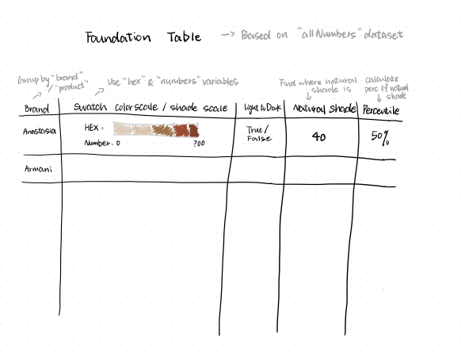

```{r load-packages, message = FALSE}
library(tidyverse)
library(glue)
library(here)
library(gt)
```

```{r load-data, message = FALSE}
allNumbers <- read_csv(here::here("02-makeup-shades", "data/allNumbers.csv"))
```

## Sketch



## Task 1: Recreate

Recreate the basics of the sketch as a table in R.

## Task 2: Improve

Improve the table above.
