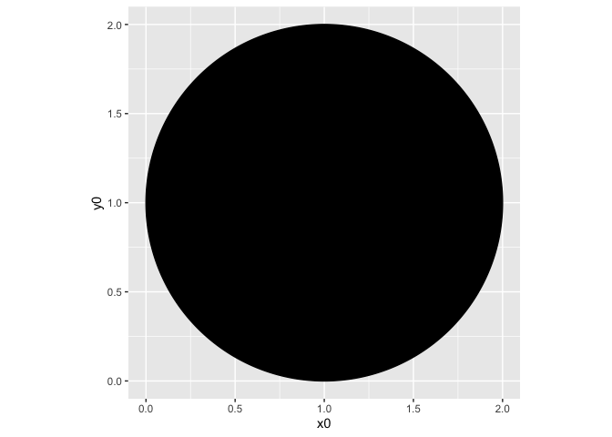
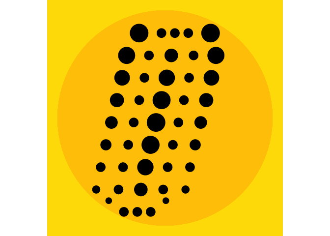

Kusama’s pumpkins
================
Mine Çetinkaya-Rundel + Lillian Clark
2/1/2022

``` r
library(tidyverse)
library(ggforce)
```

## Inspiration


## Task 1: Draw a circle

``` r
# Lets make some data
circle <- data.frame(
  x0 = 1,
  y0 = 1,
  r = 1
)

# Use coord_fixed to ensure true circularity
ggplot() +
  geom_circle(aes(x0 = x0, y0 = y0, r = r), data = circle, fill = "black") +
  coord_fixed()
```

<!-- -->

## Task 2: Place many circles in a line

``` r
# Lets make some data
circles <- tibble(
  id = 1:9,
  x1 = rep(1, 9),
  x2 = seq(-0.2, 0.2, length.out = 9),
  y = seq(-1, 1, length.out = 9),
  x_center = sin(y) / 4,
  x_center_m1 = x_center - 0.25,
  x_center_p1 = x_center + 0.25,
  r1 = 0.05,
  r2 = (-(y^2) + 2) / 20
) %>%
  mutate(
    x_center_m1 = if_else(y == max(y) | y == min(y), x_center_m1 + 0.1, x_center_m1),
    x_center_p1 = if_else(y == max(y) | y == min(y), x_center_p1 - 0.1, x_center_p1),
    x_center_m2 = if_else(y == min(y), x_center_m1 - 0.25 + 0.08, x_center_m1 - 0.25),
    r_center_mp2 = (y + 2) / 30,
    y_center_mp2 = if_else(y == min(y), y + 0.125, y),
    x_center_p2 = if_else(y == min(y), x_center_p1 + 0.25 - 0.08, x_center_p1 + 0.25)
    )

ggplot() +
  geom_circle(aes(x0 = 0.1, y0 = 0.05, r = 1.2), data = circles, fill = "#FFC700", color = "#FFC700") +
  geom_circle(aes(x0 = x_center, y0 = y, r = r2), data = circles, fill = "black") +
  geom_circle(aes(x0 = x_center_m1, y0 = y, r = r1), data = circles, fill = "black") +
  geom_circle(aes(x0 = x_center_p1, y0 = y, r = r1), data = circles, fill = "black") +
  geom_circle(aes(x0 = x_center_m2, y0 = y_center_mp2, r = r_center_mp2), data = circles, fill = "black") +
  geom_circle(aes(x0 = x_center_p2, y0 = y_center_mp2, r = r_center_mp2), data = circles, fill = "black") +
  coord_fixed() +
  theme_void() +
  theme(panel.background = element_rect(fill = "#FFDE00", color = "#FFDE00"))
```

<!-- -->

## Task 3: Draw a pumpkin made of circles

## Task 4: Repeat and add background
